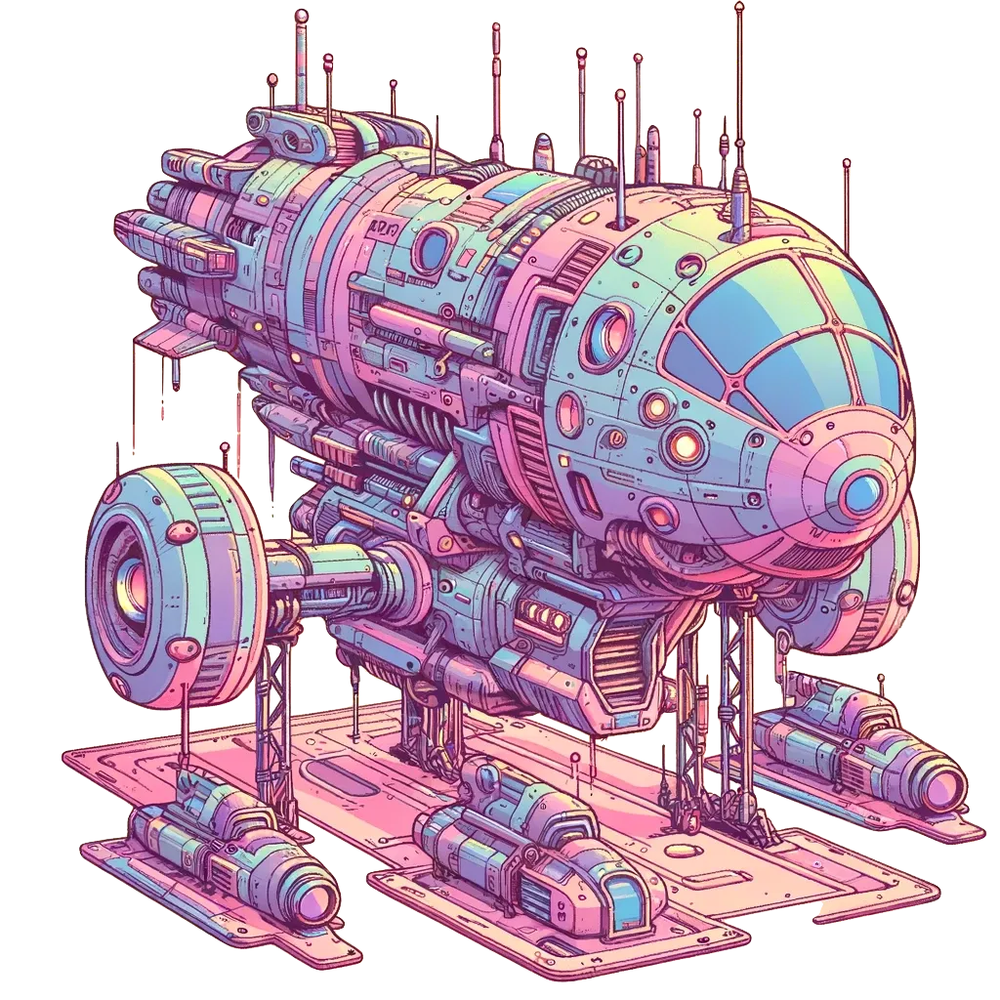

## marmulle.dev

This is my personal website built with SvelteKit and styled from scratch.  
It's my foray into frontend and is designed as a platform to show my various projects and interests.

The scifi assets were generated using Dall-e.  
The WebGPU renders run on the client in realtime. WebGPU standard is relatively new and currently supported on desktop Chromium and latest Android Chrome.
